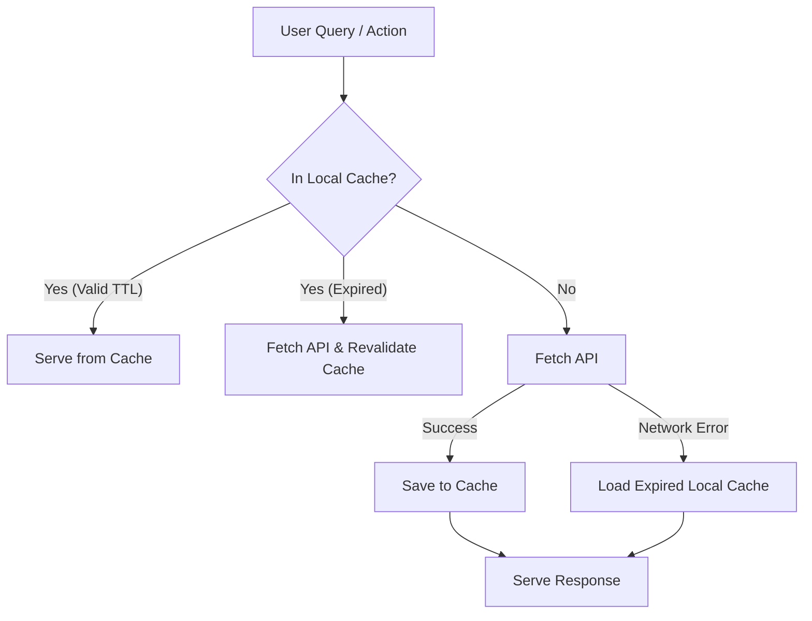

# EduForge Architecture: System Logics & Caching

This document provides a comprehensive overview of the design steps, refactoring processes, and caching mechanisms implemented across the EduForge platform.

---

## 1. Steps Taken & Key Architectures

### A. Live Line-by-Line Markdown Notes Editor
* **Obsidian-Style Rendering**: Implemented a visual markdown editor in the video player sidebar. The editor displays a raw editable `<textarea>` on the active line while instantly compiling and rendering all other inactive lines as formatted Markdown (`react-markdown` + `remark-gfm`).
* **Focus Management (Blur Bugfix)**: Resolved a critical React 19 unmounting issue where switching active lines triggered a synchronous `blur` event with `e.relatedTarget` as `null` (since the next `<textarea>` was not yet mounted/focused). Added a `setTimeout` wrapper of `50ms` in the parent `onBlur` listener to allow the next element to focus before evaluating whether focus actually left the editor.
* **Caret & Arrow Navigation**: Built custom handlers for:
  - `Enter` (splits lines, activates next, moves cursor).
  - `Backspace` (merges lines, activates previous, positions cursor at the merge boundary).
  - `ArrowUp` / `ArrowDown` (transitions between lines if the paragraph is single-line, or once the cursor reaches the start/end boundaries of a multi-line wrapped paragraph).

### B. 3D Spline Interactive Background Overlay
* **Layering & Interaction**: Configured CSS layering rules so that the 3D Spline landing page scene (`.hero-container`) responds to user mouse pointers/hovers.
* **Click-Through Setup**: 
  - Enabled pointer events on the canvas wrapper: `.hero-container { pointer-events: auto; }`.
  - Set `.front-container` (which stretches fixed across the entire viewport) to `pointer-events: none` so that the empty space between the search box and title is completely transparent to clicks.
  - Re-enabled interaction on children: `.logo, .front-form, .front-status-container, .login-signup, .front-top-actions { pointer-events: auto; }`.

### C. Refactored Modular Search Moderation
* **Deduplication**: Automatically deduplicates the `ALLOWED_CHANNELS` array at compile-time using a `Set`.
* **Normalization Pipeline**: Query inputs undergo casing standardization, Unicode normalization, leetspeak mapping (e.g., `@` -> `a`, `0` -> `o`), symbols stripping, spacing collapsing, and single-letter merging (e.g., `b o m b` -> `bomb`).
* **Typo Correction (Levenshtein Distance)**: Implemented an online correction pass. If a word in the query matches a high-risk keyword with a Levenshtein distance of exactly 1 (e.g., `bomp` -> `bomb`, `prn` -> `porn`), the query word is replaced with the corrected keyword before validation.
* **Categorized Scoring & Overrides**: Matches in `violence`, `sexual`, `illegal`, `hate`, and `distraction` add to a risk score (clamped 0–10). Educational triggers (e.g., `fundamentals`, `tutorial`, `academic`, `analysis`, `history of`) reduce the risk score.
* **Smart Redirect Suggestions**: When a query flags a `BLOCK` or `REVIEW` decision, the engine maps the category to positive, constructive alternatives (e.g., suggesting "Digital Safety" if the student queries a hacking tool).

---

## 2. Caching Logics Implemented

EduForge utilizes structured local storage cache strategies to optimize third-party API quotas (YouTube), reduce LLM costs (Groq), minimize network latency, and ensure offline resilience.

### I. Stale-While-Revalidate (SWR) API Cache
* **File**: `src/services/api.js`
* **Key Format**: `cache_${action}_${JSON.stringify(data)}`
* **Mechanism**: 
  - When `fetchApi` receives a `GET` request with `useCache: true`, it searches `localStorage` for a matching key.
  - If the cache timestamp is within the `CACHE_TTL` limit and matches the target component's version (for schema migration safety), the cached data is returned instantly.
  - Concurrently, a background revalidation request is executed without blocking the user, refreshing the cache silently.
* **Request Deduplication**: Uses a `pendingRequests` Map to prevent making duplicate, simultaneous fetch requests for the exact same query.

### II. YouTube Proxy Cache with Offline Fallback
* **File**: `src/services/youtube.js`
* **Key Format**: `yt_cache_${currentUser}_${endpoint}_${JSON.stringify(params)}`
* **TTL**: 6 Hours.
* **Mechanism**:
  - Caches YouTube search results and metadata returned from the Supabase `youtube-proxy` Edge Function to prevent exhausting API limits.
  - **Offline/Failure Fallback**: If the network request fails (due to quota depletion or offline states), the service intercepts the error, checks for an expired local cache key, and returns the stale cache rather than failing, resulting in continuous offline usability.

### III. AI Groq Content Moderation Cache
* **File**: `src/services/groq.js`
* **Key Format**: `eduforge_groq_cache_${currentUser}_${encodeURIComponent(normalizedQuery)}`
* **TTL**: 24 Hours.
* **Mechanism**:
  - Caches filtered video IDs approved by the Groq API for a given search query.
  - Reduces LLM token fees and user search latency down to zero milliseconds on repeat queries.

### IV. Safe Channels Lookup Optimization
* **File**: `src/constants.js` and `src/pages/Home.jsx`
* **Lookup**:
  - Pre-compiles the deduplicated `ALLOWED_CHANNELS` flat array into a `Set`: `ALLOWED_CHANNELS_SET = new Set(...)`.
  - Replaces slow $O(N)$ linear scans (`ALLOWED_CHANNELS.some(...)`) with fast $O(1)$ lookups (`ALLOWED_CHANNELS_SET.has(...)`), optimizing performance during rendering.

### V. User Profile & Preferences Persistence
* **File**: `src/App.jsx` and `src/components/theme-selector/ThemeSelector.jsx`
* **Cache**:
  - Caches user sign-in tokens (`user`) and active CSS theme identifiers (`eduforge-theme`) to retain customization on page reloads.

### VI. Safety Rate-Limiting & Cooldown Cache
* **File**: `src/services/moderation.js`
* **Cache**:
  - Caches rate-limit parameters: active cooldown expirations (`eduforge_cooldown_until`), violation counts (`eduforge_violation_count`), and timestamps (`eduforge_last_violation_time`).
  - Implements a 5-minute good behavior period that resets violation tallies automatically.
